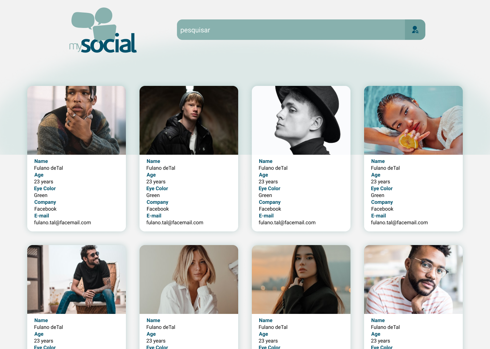
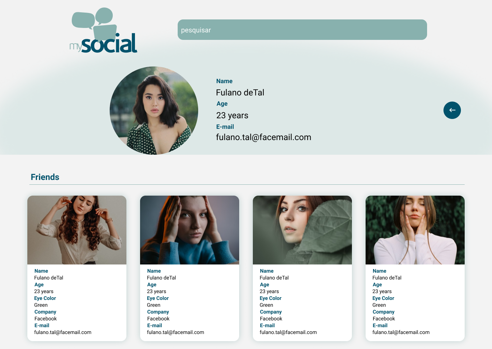
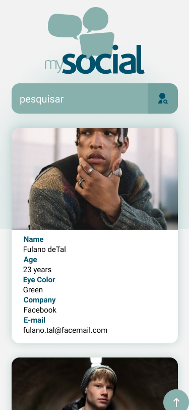
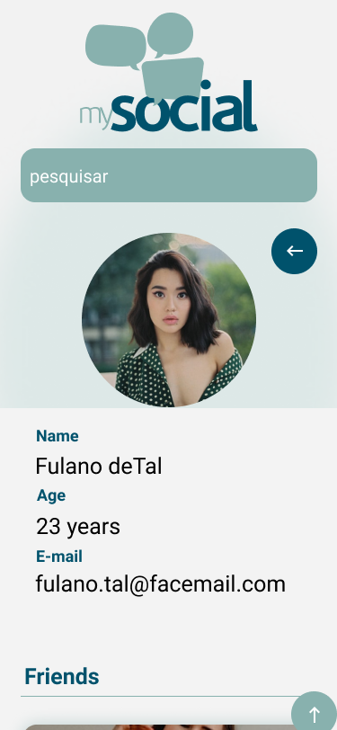

# MYSOCIAL

***

Rede Social - MySocial

# Logo

  

> Foi criado uma marca para o projeto, trazendo elementos sociais do Dialogo.

# Layout Base

## Web

  

  

## Mobile Responsivo

  

  

>[FIGMA](https://www.figma.com/file/AdotszLpnlD9hSG08swHwi/Dialog?node-id=4%3A611)

## BACK-END

> O Documento abaixo tem como objetivo descrever
> [Documento](backend/README.md)

## FRONT-END

> O Documento abaixo tem como objetivo descrever
> [Documento](frontend/README.md)

